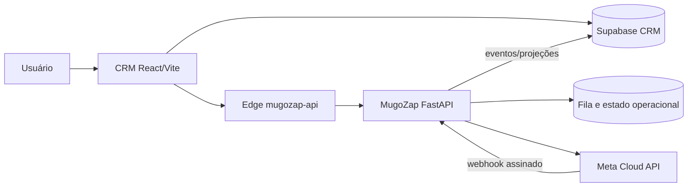
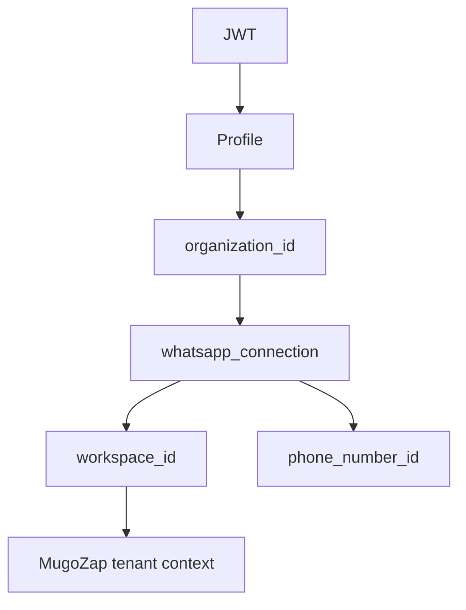
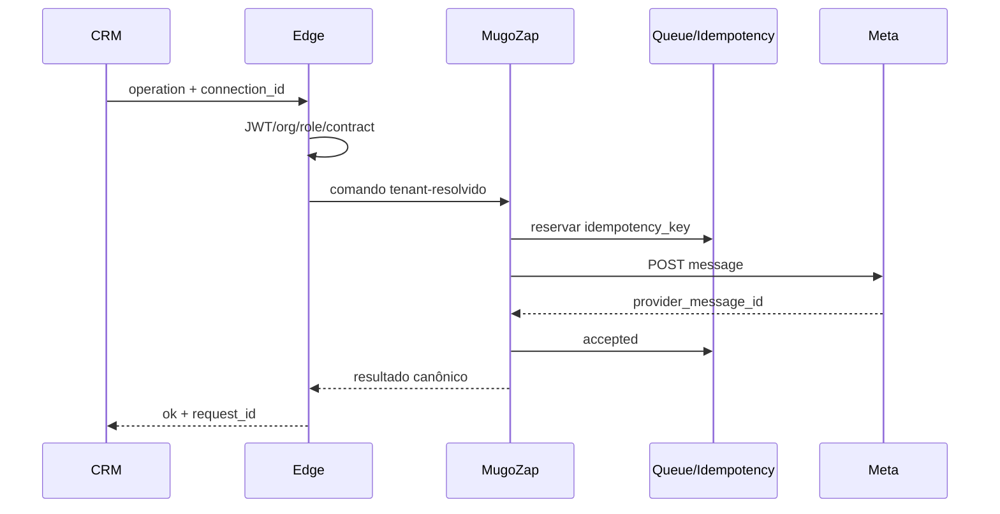
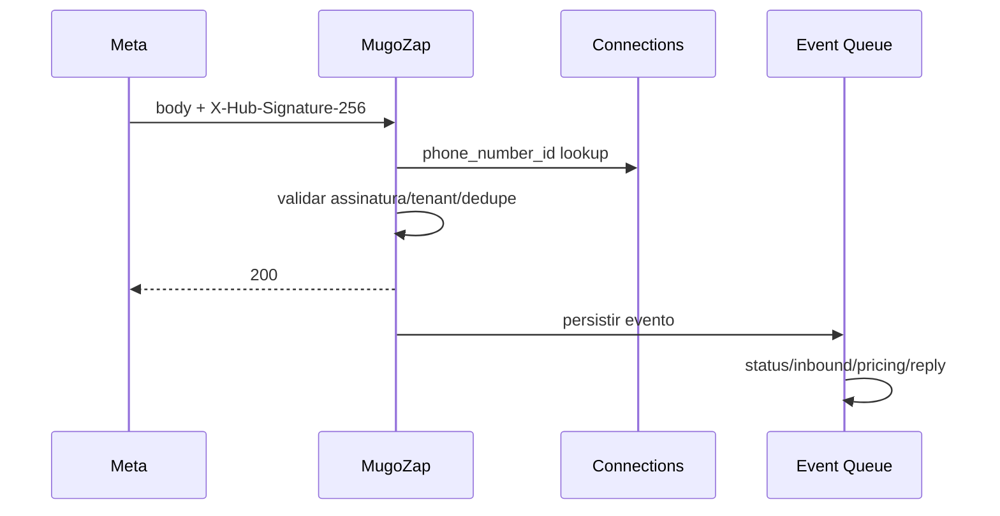
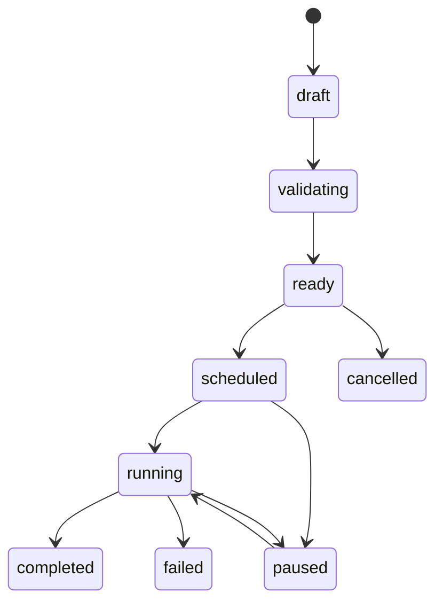
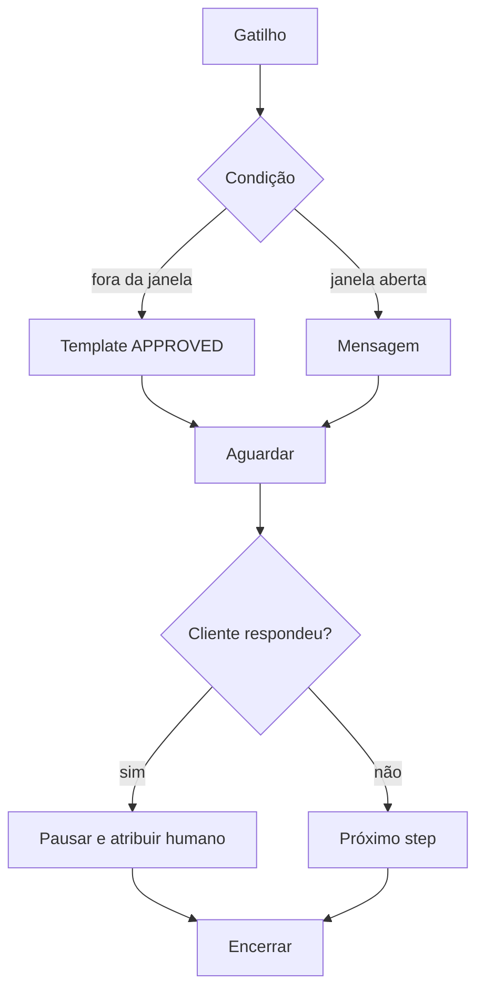
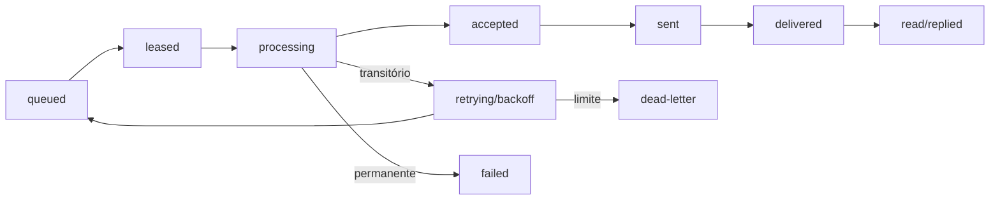
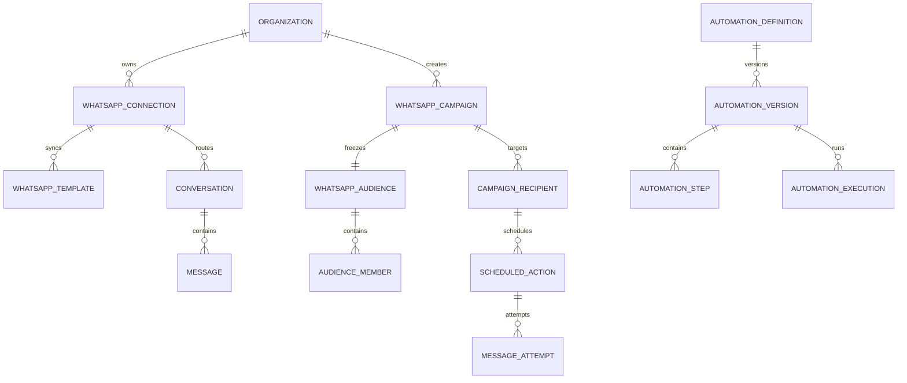

# Blueprint definitivo — Mugô WhatsApp Automation

Data: 2026-07-28  
Status: proposta arquitetural; nenhuma implementação autorizada

## Legenda de decisão

- **Fato confirmado:** comportamento comprovado pela auditoria estática.
- **Decisão proposta:** direção deste blueprint, ainda não implementada.
- **Hipótese:** suposição que precisa de evidência adicional.
- **Pendência de validação:** escolha ou condição que deve ser resolvida antes da implementação.

Este documento preserva React/Vite, Supabase Auth e banco do CRM, a Edge Function `mugozap-api`, FastAPI/MugoZap, Meta WhatsApp Cloud API e o atendimento atual. Essa divisão já existe e foi confirmada na auditoria (`docs/whatsapp-automation-audit.md:20-30`, `docs/whatsapp-automation-audit.md:32-70`).

# 1. Visão do produto

## 1.1 Definição

**Decisão proposta:** Mugô WhatsApp Automation será um SaaS multicliente para comunicação, atendimento humano, campanhas pontuais e automações contínuas no WhatsApp. Cada organização terá uma ou mais conexões próprias, dados isolados, templates oficiais, públicos congelados, consentimento, limites, métricas e auditoria.

O produto terá os módulos:

| Módulo | Responsabilidade |
| --- | --- |
| Conexões WhatsApp | Vincular organização, WABA, número, credencial e saúde |
| Templates | Sincronizar, parametrizar, testar e acompanhar aprovação |
| Campanhas | Disparo pontual, aprovado e mensurável para público congelado |
| Automações | Fluxos contínuos versionados, acionados por evento |
| Caixa de entrada | Atendimento compartilhado com contexto CRM |
| Contatos e CRM | Clientes, contratos, parcelas, tags e conversões |
| Métricas | Funil operacional e comercial |
| Custos | Pricing por conexão, categoria, país e campanha |
| Consentimento | Opt-in, opt-out, prova e suppression list |
| Configurações | Limites, horários, timezone, frequência e defaults |
| Administração Mugô | Tenants, planos, saúde, suporte e auditoria global controlada |

## 1.2 Conceitos

| Conceito | Definição definitiva |
| --- | --- |
| Campanha pontual | Conjunto finito de destinatários congelados, template e janela de execução |
| Automação contínua | Definição versionada que inscreve contatos conforme eventos recorrentes |
| Empresa inicia conversa | Primeiro contato ou retorno fora da janela; exige template APPROVED |
| Dentro da janela | Até 24 horas após mensagem do cliente, calculado no servidor |
| Atendimento humano | Operador assume a conversa; automações de resposta ficam pausadas |
| Execução automatizada | Worker executa ação aprovada, idempotente e auditável |

**Fato confirmado:** o sistema atual diferencia mensagem livre e template, mas a janela é autoridade apenas do frontend e o endpoint de template é restrito a um modelo (`docs/whatsapp-automation-audit.md:72-95`, `docs/whatsapp-automation-audit.md:307-315`).

# 2. Responsabilidades definitivas

## 2.1 CRM/Supabase CRM

**Decisão proposta:** fonte de verdade de:

- organização, usuários e papéis;
- clientes, contratos e parcelas;
- conexões autorizadas, configurações e limites comerciais;
- campanhas, públicos, aprovação e auditoria;
- consentimento, descadastro e atribuição de receita;
- interface, relatórios e administração SaaS.

O CRM não envia diretamente à Meta, não executa workers e não contém credenciais.

## 2.2 Edge Function `mugozap-api`

**Decisão proposta:** gateway/BFF stateless:

- autentica JWT;
- resolve profile e `organization_id`;
- valida papel/permissão;
- resolve `connection_id` autorizado;
- valida request/response;
- cria `request_id`;
- encaminha ao MugoZap;
- padroniza erros;
- nunca executa campanha longa;
- nunca aceita `workspace_id` arbitrário do frontend.

**Fato confirmado:** a Edge já autentica JWT e organização, mas hoje encaminha `X-Workspace-Id` e também consulta a Meta (`docs/whatsapp-automation-audit.md:22-30`, `docs/whatsapp-automation-audit.md:173-199`).

## 2.3 MugoZap

**Decisão proposta:** executor operacional único:

- adaptador único da Meta;
- executor único de mensagens/templates;
- catálogo operacional de templates;
- webhooks assinados;
- janela de 24 horas;
- idempotência persistida;
- filas, leases, retries e rate limiting;
- conversas, mensagens, automações e workers;
- status, pricing e eventos.

## 2.4 Meta

**Decisão proposta:** provedor externo soberano para envio, entrega, leitura, templates oficiais, qualidade, limites, pricing e webhooks.

## 2.5 Matriz RACI

| Capacidade | CRM | Edge | MugoZap | Meta |
| --- | --- | --- | --- | --- |
| Autenticar usuário | A/R | R/valida | C | — |
| Resolver tenant | A | R | valida conexão | — |
| Conectar WABA | A/R UI | gateway | R integração | A provedor |
| Templates oficiais | cache/UI | proxy | A/R | origem |
| Campanha | A/R definição | gateway | R execução | entrega |
| Automação | A/R configuração | gateway | A/R runtime | eventos |
| Mensagem | solicita | valida | A/R envia | processa |
| Webhook | consulta evento | — | A/R recebe | emite |
| Consentimento | A/R | valida | revalida | — |
| Métricas comerciais | A/R | gateway | eventos operacionais | status/pricing |
| Custos | relatório | gateway | A/R cálculo | origem |

## 2.6 Duplicidades a unificar

| Atual | Estado alvo |
| --- | --- |
| Edge e MugoZap consultam templates | MugoZap consulta; CRM mantém cache |
| Perfis/papéis separados | CRM é origem; MugoZap recebe claims resolvidos |
| Cobrança em alertas CRM e conversa MugoZap | eventos canônicos correlacionados |
| Status/custo em dois lugares | mensagem/evento MugoZap; projeções CRM |
| Idempotência só na Edge | reserva transacional no MugoZap |

**Fato confirmado:** duplicidades atuais estão catalogadas na auditoria (`docs/whatsapp-automation-audit.md:294-305`).

# 3. Arquitetura multicliente

## 3.1 Entidade canônica `whatsapp_connections`

**Decisão proposta:** entidade control-plane no Supabase CRM:

| Campo | Tipo conceitual | Regra |
| --- | --- | --- |
| `id` | uuid | PK |
| `organization_id` | uuid | FK organização, obrigatório |
| `workspace_id` | text | identidade do tenant no MugoZap |
| `provider` | text | inicialmente `meta_cloud_api` |
| `waba_id` | text | obrigatório quando conectada |
| `phone_number_id` | text | obrigatório quando conectada |
| `display_phone_number` | text | mascarado na UI |
| `verified_name` | text | snapshot Meta |
| `status` | enum | draft, connecting, active, degraded, disabled, revoked |
| `graph_api_version` | text | versão validada |
| `credential_reference` | text | referência opaca ao cofre |
| `webhook_verify_reference` | text | referência opaca |
| `connection_health` | jsonb | status sanitizado |
| `last_sync_at` | timestamptz | última sincronização |
| `created_by` | uuid | FK auth user |
| `created_at` | timestamptz | obrigatório |
| `updated_at` | timestamptz | obrigatório |

## 3.2 Constraints e índices

**Decisão proposta:**

- unique ativo: `(provider, phone_number_id)`;
- unique organizacional: `(organization_id, provider, waba_id, phone_number_id)`;
- índice `(organization_id, status)`;
- índice único `(workspace_id, id)`;
- check de IDs Meta numéricos;
- check da versão `^v[0-9]+\.[0-9]+$`;
- nenhuma conexão `active` sem credential e webhook references;
- RLS por `organization_id`;
- `connection_id` obrigatório em novas entidades operacionais.

## 3.3 Organização e workspace

**Decisão proposta:** `organization_id` é identidade de negócio; `workspace_id` é identidade de execução. A relação é criada server-side e imutável para usuários comuns. Uma organização poderá possuir N conexões; cada conexão aponta para exatamente um workspace de execução. Um workspace pode servir uma organização, nunca múltiplas organizações.

**Fato confirmado:** hoje não há vínculo canônico entre os dois IDs (`docs/whatsapp-automation-audit.md:25-30`, `docs/whatsapp-automation-audit.md:234-274`).

## 3.4 Inbound

`metadata.phone_number_id` resolve `whatsapp_connection`, depois organização e workspace. Nenhuma resolução por número do remetente.

## 3.5 Credenciais

**Decisão proposta:** banco guarda somente referências opacas. O MugoZap resolve a referência em cofre/secret manager no runtime. Token nunca atravessa CRM, Edge response, Realtime, logs ou exportações.

## 3.6 Legado

**Decisão proposta:** criar uma conexão `legacy-default`, vinculada ao WABA/número atuais, com adapters que mantenham endpoints existentes. O default workspace deixa de ser fallback e passa a ser um registro explícito. Não apagar variáveis legadas até a migração concluir.

**Pendência de validação:** confirmar se CRM e MugoZap usam o mesmo projeto Supabase; a auditoria não conseguiu provar isso (`docs/whatsapp-automation-audit.md:608-614`).

# 4. Contrato de identidade e tenant

## 4.1 Fluxo

```text
JWT
→ profiles.id
→ profiles.organization_id
→ whatsapp_connections.organization_id
→ connection.id/workspace_id
→ comando assinado internamente ao MugoZap
```

**Decisão proposta:** o frontend envia `connection_id`; a Edge procura a conexão dentro da organização. A Edge gera um contexto interno `{organization_id, connection_id, workspace_id, actor_id, role}`. O MugoZap valida que `connection_id` corresponde ao workspace.

## 4.2 Proibições

- frontend não envia workspace efetivo;
- chave global não pode assumir tenant por header;
- não há fallback sem tenant;
- número/wa_id nunca determina organização;
- service role não é autorização de negócio.

**Fato confirmado:** chave global + workspace arbitrário e fallbacks sem workspace são riscos atuais (`docs/whatsapp-automation-audit.md:307-320`, `docs/whatsapp-automation-audit.md:322-341`).

## 4.3 Webhook

```text
metadata.phone_number_id
→ lookup connection
→ validar active
→ organization_id
→ workspace_id
→ persistir event_id
→ processar
```

- desconhecida: responder `200` após registrar evento mínimo em quarentena, sem automação;
- desativada: persistir `ignored_connection_disabled`, sem resposta/envio;
- duplicada: incidente crítico, bloquear processamento;
- assinatura inválida: `401/403`, sem persistência do body completo;
- tenant ausente: dead-letter operacional.

**Fato confirmado:** hoje inbound usa o workspace padrão (`docs/whatsapp-automation-audit.md:110-120`).

# 5. Templates

## 5.1 Fonte operacional

**Decisão proposta:** MugoZap é fonte operacional única. Meta é origem oficial; CRM possui projeção/cache para UX e auditoria.

## 5.2 Entidades conceituais

- `whatsapp_templates`: identidade por conexão, nome e idioma;
- `whatsapp_template_versions`: snapshot imutável de components/status;
- `whatsapp_template_parameter_definitions`: ordem, tipo e constraints;
- projeção CRM preserva `whatsapp_message_templates` por adapter.

## 5.3 Sincronização

1. CRM solicita sync na Edge.
2. Edge resolve conexão.
3. MugoZap consulta Meta com credencial daquela conexão.
4. MugoZap versiona diferenças.
5. Evento `template.synced` atualiza cache CRM.
6. Templates ausentes ficam desativados, nunca apagados.

**Fato confirmado:** hoje a sincronização está duplicada e há suporte desigual de components (`docs/whatsapp-automation-audit.md:86-95`, `docs/whatsapp-automation-audit.md:294-305`).

## 5.4 Componentes suportados

| Componente | Representação |
| --- | --- |
| BODY | texto e parâmetros ordenados |
| HEADER | text/image/video/document |
| FOOTER | texto sem parâmetro de envio |
| BUTTONS | lista ordenada |
| QUICK_REPLY | payload/label |
| URL | URL estática ou sufixo dinâmico |
| PHONE_NUMBER | telefone validado |
| COPY_CODE | coupon code |
| IMAGE/VIDEO/DOCUMENT | media handle ou URL aprovada |

O payload de envio é validado contra a versão exata. Parâmetros extras, ausentes ou fora de ordem são rejeitados antes da fila.

## 5.5 Estados

`draft_local`, `submitted`, `pending`, `approved`, `rejected`, `paused`, `disabled`, `deleted_remote`, `sync_error`.

Somente `approved + active + versão atual + categoria permitida` inicia campanha.

## 5.6 Jornada

- sincronizar;
- visualizar conteúdo e components;
- testar para allowlist;
- duplicar configuração de variáveis, não o template oficial;
- submeter novo template via MugoZap/Meta;
- acompanhar status/qualidade;
- receber alertas de pausa/rejeição.

# 6. Campanhas replicáveis

## 6.1 Biblioteca inicial

Templates de configuração independentes de nicho:

- reativação 30/60/90/180 dias;
- cobrança pendente;
- renovação próxima;
- recuperação de lead;
- pós-venda;
- carrinho abandonado;
- confirmação de agendamento;
- pesquisa de satisfação;
- personalizada.

## 6.2 Inatividade por evento

**Decisão proposta:** inatividade é uma regra sobre evento e timestamp, nunca um campo genérico:

- sem comprar;
- sem responder;
- sem agendar;
- sem renovar;
- sem pagar;
- sem contratar;
- sem interagir;
- sem abrir conversa;
- sem converter.

Cada regra declara `event_type`, fonte, data de referência, operador, duração, timezone e tratamento de nulos.

## 6.3 Assistente

1. objetivo;
2. período;
3. critério de inatividade;
4. público;
5. conexão;
6. template APPROVED;
7. mapa de variáveis;
8. horário/timezone;
9. teste allowlisted;
10. revisão de amostra/custos/exclusões;
11. publicação com aprovação.

## 6.4 Estados

`draft → validating → ready → scheduled → running → completed`

Transições laterais: `paused`, `cancelled`, `failed`. Publicar exige versão imutável, público congelado, consentimento e aprovador.

**Fato confirmado:** não existem endpoints/tabelas de campanha hoje (`docs/whatsapp-automation-audit.md:122-171`, `docs/whatsapp-automation-audit.md:461-476`).

# 7. Públicos e segmentação

## 7.1 Entidades

### `whatsapp_audiences`

Definição reutilizável: organização, nome, descrição, critérios JSON versionados, timezone, owner, status.

### `whatsapp_audience_members`

Snapshot: audience/version, campaign, contact/client, telefone normalizado, connection, eligibility, reason, variable snapshot, consent snapshot e hash.

## 7.2 Critérios

- última compra/resposta/agendamento/cobrança;
- status/tags;
- gasto/cidade/origem/produto;
- contrato/parcela;
- consentimento;
- campanhas anteriores.

## 7.3 Congelamento

**Decisão proposta:** ao passar para `ready`, gerar snapshot imutável. Mudança no cliente não adiciona destinatários silenciosamente. Antes do envio, regras críticas são revalidadas: tenant, telefone, opt-out, consentimento, conexão e limite.

## 7.4 Proteções

Cada membro recebe `eligible` e `ineligibility_reason`:

- `invalid_phone`;
- `suppressed`;
- `consent_missing`;
- `duplicate_recipient`;
- `already_included`;
- `cross_tenant`;
- `concurrent_campaign`;
- `frequency_cap`;
- `connection_unavailable`;
- `template_unavailable`.

# 8. Automações contínuas

## 8.1 Diferença

Campanha tem público finito e execução delimitada. Automação permanece ativa e cria enrollments por evento.

## 8.2 Entidades

- `whatsapp_automation_definitions`: identidade e status;
- `whatsapp_automation_versions`: grafo imutável aprovado;
- `whatsapp_automation_steps`: blocos/edges/configuração;
- `whatsapp_automation_executions`: instância por enrollment;
- `whatsapp_automation_enrollments`: contato, versão e estado.

## 8.3 Blocos

gatilho, template, mensagem livre, aguardar, condição, cliente respondeu, texto contém, tag, atualizar cliente, criar tarefa, atribuir atendente, webhook, e-mail, pausar e encerrar.

## 8.4 Regras

- fora da janela, primeiro outbound é template APPROVED;
- mensagem livre exige janela server-side;
- inbound cancela waits incompatíveis e pode pausar automação;
- operador humano assumindo pausa ações conversacionais;
- ações administrativas não conversacionais podem continuar se explicitamente permitido;
- versão publicada é imutável;
- execução guarda versão e inputs.

**Fato confirmado:** há `flow_state` e follow-up específico, mas não motor durável genérico (`docs/whatsapp-automation-audit.md:461-476`).

# 9. Caixa de entrada compartilhada

## 9.1 Modelo

Preservar o inbox atual e adicionar progressivamente:

- conexão e fila;
- responsável/status/tags;
- automação ativa e motivo;
- modo humano/bot;
- histórico/status;
- templates;
- cliente/contrato/parcela;
- origem/campanha/automação;
- janela de atendimento.

## 9.2 Ações

assumir, transferir, pausar automação, retomar, mensagem, template, tarefa, encerrar e resolver.

## 9.3 Regras

- assumir cria evento e lease humano;
- enviar pausa automação conversacional;
- transferência preserva histórico;
- encerrar não apaga;
- resolução é reversível;
- exclusão destrutiva fica fora do fluxo comum.

**Fato confirmado:** inbox, atribuição, handoff, tasks e exclusão destrutiva já existem (`docs/whatsapp-automation-audit.md:140-169`, `docs/whatsapp-automation-audit.md:307-320`).

# 10. Fila e executor

## 10.1 Entidades no domínio MugoZap

### `whatsapp_scheduled_actions`

tenant, connection, source_type/id, recipient, step, run_at, timezone, payload reference, status, priority, lease, attempts e timestamps.

### `whatsapp_message_attempts`

action, attempt number, request ID, provider response sanitizada, HTTP/status, started/finished e erro.

### `whatsapp_idempotency_keys`

scope, key, request hash, reservation state, provider ID e resultado final.

### `whatsapp_dead_letters`

action/event, reason, payload sanitizado, attempts, resolution e operator.

## 10.2 Estados

`queued → leased → processing → accepted → sent → delivered → read → replied`

Falhas: `retrying`, `failed`, `cancelled`, dead-letter. `accepted` significa Meta confirmou ID; não significa entrega.

## 10.3 Lease e concorrência

- claim atômico por `FOR UPDATE SKIP LOCKED` ou RPC equivalente;
- `lease_owner` e `lease_expires_at`;
- heartbeat;
- lease expirado volta a `queued` somente se idempotency result não for ambíguo;
- concorrência particionada por `connection_id`;
- ordenação não é garantida entre contatos; é garantida dentro de execution quando necessário.

## 10.4 Retry

- transitório: rede sem aceitação comprovada, 429, 5xx;
- permanente: número inválido, template rejeitado, opt-out;
- ambíguo: timeout após POST; consultar idempotência/provider/histórico, nunca reenviar cegamente;
- backoff exponencial com jitter;
- máximo por tipo;
- dead-letter após limite.

## 10.5 Limites

- token bucket por conexão;
- limite por campanha/minuto/dia;
- prioridade: atendimento humano > transactional > campaign;
- pausa global/conexão/campanha;
- cancelamento impede novos leases.

**Fato confirmado:** o follow-up atual envia no próprio processo e não constitui fila durável (`docs/whatsapp-automation-audit.md:307-320`).

# 11. Idempotência

## 11.1 Escopos

| Ação | Composição |
| --- | --- |
| Manual | org + connection + conversation + client_request_id |
| Teste | org + connection + template_version + recipient + test_request |
| Campanha | org + connection + campaign_version + recipient |
| Step | org + automation_execution + step + iteration |
| Webhook | provider + connection + provider_event/message_id + event_type |

## 11.2 Garantia

1. MugoZap reserva chave e request hash em transação.
2. Mesma chave/hash retorna resultado existente.
3. Mesma chave com hash diferente retorna conflito.
4. POST Meta acontece após reserva.
5. Provider ID finaliza a reserva.
6. Timeout deixa `result_unknown`.
7. Nova tentativa consulta a reserva; nunca cria segundo POST sem resolução explícita.

**Fato confirmado:** hoje a Edge exige chave, mas o executor a ignora (`docs/whatsapp-automation-audit.md:76-95`, `docs/whatsapp-automation-audit.md:307-315`).

# 12. Janela de 24 horas

## 12.1 Estado server-side

- `last_customer_message_at`;
- `service_window_expires_at`;
- `service_window_open` derivado;
- `source`;
- `timezone`.

## 12.2 Regras

- inbound válido abre/reabre por 24h;
- texto livre só com janela aberta;
- template APPROVED fora da janela;
- worker revalida imediatamente antes;
- humano respeita a mesma regra;
- frontend exibe snapshot, nunca autoriza;
- relógio usa UTC e apresenta timezone da organização.

**Fato confirmado:** hoje o bloqueio é frontend-only (`docs/whatsapp-automation-audit.md:307-315`, `docs/whatsapp-automation-audit.md:461-476`).

# 13. Webhooks e segurança

## 13.1 Pipeline

1. ler body bruto com limite;
2. resolver conexão por `phone_number_id`;
3. buscar `META_APP_SECRET` pela referência;
4. validar `X-Hub-Signature-256` em tempo constante;
5. rejeitar assinatura inválida;
6. deduplicar evento;
7. persistir envelope bruto sanitizado/criptografado conforme retenção;
8. responder rapidamente;
9. processar assíncrono;
10. atualizar status/inbound/reply/pricing/error.

## 13.2 Logging

Remover:

- secrets e headers;
- telefone completo;
- conteúdo integral em logs comuns;
- responses brutas indiscriminadas;
- endpoints debug em produção.

Usar request/event IDs, connection, tenant, tipos, tamanhos, status e códigos.

**Fato confirmado:** webhook não valida assinatura, há PII/secret em logs e endpoints debug (`docs/whatsapp-automation-audit.md:118-120`, `docs/whatsapp-automation-audit.md:307-336`).

# 14. Consentimento e descadastro

## 14.1 Entidades

### `whatsapp_consents`

organization, connection/contact, purpose, channel, status, source, proof reference, collected/revoked timestamps e actor.

### `whatsapp_suppression_list`

organization, normalized recipient hash/phone protegido, scope, reason, source event, effective_at, reversible e auditoria.

## 14.2 Finalidades

transactional, billing, appointment, support, marketing/reactivation e research. Consentimento não é automaticamente transferível entre finalidades.

## 14.3 Palavras

`sair`, `parar`, `cancelar`, `não quero`, `remover` e variações normalizadas.

Ao detectar:

1. registrar inbound;
2. criar opt-out idempotente;
3. suprimir campanhas futuras;
4. cancelar scheduled actions não transacionais;
5. pausar automações de marketing;
6. enviar confirmação somente se juridicamente/configuracionalmente permitida;
7. manter atendimento humano disponível.

**Fato confirmado:** não existe descadastro no código auditado (`docs/whatsapp-automation-audit.md:461-476`).

# 15. Métricas

## 15.1 Funil

`elegível → incluído → enfileirado → aceito → enviado → entregue → lido → respondido → convertido`

Saídas paralelas: `descadastrado`, `falhou`, `cancelado`, `suprimido`.

## 15.2 Indicadores

- volume e taxas de entrega/leitura/resposta/conversão/falha;
- custo total/unitário;
- receita atribuída e ROI;
- tempo de resposta e conversão;
- template, campanha, nicho e conexão;
- opt-out/frequency cap;
- qualidade e limite da conta.

## 15.3 Disponibilização ao CRM

**Decisão proposta:** MugoZap mantém eventos operacionais; CRM recebe projeções:

- consultas via Edge para detalhe recente;
- tabelas agregadas por organização/campanha;
- eventos idempotentes para atualização;
- reconciliação periódica;
- nenhuma métrica calculada só no navegador.

**Fato confirmado:** status/pricing existem no MugoZap, mas métricas estão duplicadas/incompletas (`docs/whatsapp-automation-audit.md:103-108`, `docs/whatsapp-automation-audit.md:294-305`).

# 16. Permissões

## 16.1 Papéis

| Permissão | Owner | Admin | Manager | Operator | Analyst | Viewer |
| --- | --- | --- | --- | --- | --- | --- |
| Conectar conta | sim | sim | não | não | não | não |
| Sincronizar template | sim | sim | sim | não | não | não |
| Criar campanha | sim | sim | sim | não | não | não |
| Aprovar/publicar | sim | sim | opcional por política | não | não | não |
| Enviar teste | sim | sim | sim | opcional | não | não |
| Pausar/cancelar | sim | sim | sim | não | não | não |
| Custos | sim | sim | configurável | não | sim | configurável |
| Inbox | sim | sim | sim | sim | leitura | leitura |
| Exportar | sim | sim | configurável | não | configurável | não |
| Usuários | sim | sim | não | não | não | não |

**Decisão proposta:** permissões são capabilities, não apenas comparação de role. Owner não pode ser removido sem transferência.

**Fato confirmado:** hoje CRM e MugoZap possuem modelos de papel diferentes (`docs/whatsapp-automation-audit.md:294-305`, `docs/whatsapp-automation-audit.md:338-341`).

# 17. Segurança e LGPD

## 17.1 Controles

- criptografia em trânsito e em repouso;
- secrets por referência e rotação;
- PII mascarada por padrão;
- trilha imutável para ações críticas;
- retenção configurável por classe;
- exportação e exclusão auditadas;
- mínimo privilégio/RLS;
- tenant em toda PK lógica/índice;
- rate limit e quotas;
- aprovação humana;
- proteção contra enumeração e abuso;
- backups e restore testado.

## 17.2 Retenção

Definir classes: payload webhook bruto curto, mensagens conforme contrato/legal, métricas agregadas maiores, logs técnicos mínimos. Exclusão do cliente não pode quebrar auditoria financeira; aplicar anonimização quando necessário.

## 17.3 Bloqueadores

Antes de SaaS:

- assinatura webhook;
- tenant por conexão;
- remover secret/PII de logs;
- remover fallback sem tenant;
- revisar RLS integral;
- desativar debug em produção.

**Fato confirmado:** riscos críticos/altos estão descritos na auditoria (`docs/whatsapp-automation-audit.md:322-341`).

# 18. Compatibilidade incremental

## 18.1 Preservar

- inbox;
- templates/cache atual;
- cobrança;
- endpoints;
- links cliente-conversa;
- alertas/histórico;
- usuários;
- automações antigas.

## 18.2 Adapters

- Edge operation adapter: operação atual → contrato V2;
- connection adapter: ausência de connection → legacy-default;
- template projection adapter: resposta MugoZap → schema CRM atual;
- conversation adapter: `workspace_id + wa_id` → connection;
- event adapter: status MugoZap → alertas/histórico CRM;
- automation adapter: fluxos antigos continuam em legacy engine até drenagem.

## 18.3 Feature flags

- `WHATSAPP_CONNECTIONS_V2`
- `WHATSAPP_TEMPLATES_V2`
- `WHATSAPP_CAMPAIGNS_ENABLED`
- `WHATSAPP_AUTOMATIONS_V2`
- `WHATSAPP_SIGNED_WEBHOOKS`
- `WHATSAPP_SERVER_WINDOW_ENFORCEMENT`

Flags são server-side por organização/conexão; frontend apenas reflete capabilities.

**Fato confirmado:** endpoints atuais e tabelas auxiliares estão inventariados (`docs/whatsapp-automation-audit.md:122-230`).

# 19. Roadmap

## Fase 0 — segurança emergencial

- Objetivo: fechar riscos críticos sem mudar UX.
- Dependências: acesso ao deploy MugoZap e segredo Meta.
- Backend: assinatura, logs sanitizados, debug bloqueado, tenant obrigatório em novas paths.
- Frontend: nenhum.
- Banco: event/quarantine somente se aprovado.
- Testes: assinatura válida/inválida, replay, logs.
- Flags: `WHATSAPP_SIGNED_WEBHOOKS`.
- Riscos: rejeitar webhook legítimo por secret incorreto.
- Rollback: modo dual validate/report, depois enforce.
- Aceite: 100% webhooks válidos, zero secret/PII crítica em logs.

## Fase 1 — conexão multicliente

- Objetivo: conexão canônica e roteamento.
- Dependências: Fase 0; decisão de cofre.
- Backend: resolver connection e credencial.
- Frontend: tela simples de conexão/saúde.
- Banco: `whatsapp_connections`, RLS e legacy record.
- Testes: cross-tenant, unknown/disabled/duplicate phone ID.
- Flags: `WHATSAPP_CONNECTIONS_V2`.
- Riscos: mapeamento legado incorreto.
- Rollback: adapter legacy-default.
- Aceite: inbound/outbound de duas conexões isoladas.

## Fase 2 — templates unificados

- Objetivo: MugoZap como fonte única.
- Dependências: connection V2.
- Backend: sync/version/components completos.
- Frontend: catálogo/cache e teste restrito.
- Banco: versions/parameter definitions.
- Testes: BODY/HEADER/buttons/media e estados.
- Flags: `WHATSAPP_TEMPLATES_V2`.
- Riscos: divergência de payload.
- Rollback: adapter mantém cache/endpoint atual.
- Aceite: sync e teste por conexão sem Meta direta na Edge.

## Fase 3 — campanha controlada

- Objetivo: uma campanha finita, aprovada e idempotente.
- Dependências: consentimento mínimo, fila e templates V2.
- Backend: audience snapshot, scheduled actions, idempotency.
- Frontend: wizard/revisão/pausa.
- Banco: campaigns, audiences, recipients, queue.
- Testes: duplicidade, opt-out, cancelamento, timeout.
- Flags: `WHATSAPP_CAMPAIGNS_ENABLED`.
- Riscos: volume/custo.
- Rollback: pausar flag e worker; preservar estados.
- Aceite: campanha allowlisted sem duplicidade.

## Fase 4 — métricas e webhooks

- Objetivo: funil reconciliável.
- Dependências: eventos assinados e IDs correlacionados.
- Backend: event log/projeções.
- Frontend: dashboards.
- Banco: events/aggregates.
- Testes: sent→delivered→read→reply, eventos fora de ordem.
- Flags: connections/campaigns.
- Riscos: contagem dupla.
- Rollback: recalcular projeções do event log.
- Aceite: métricas batem com amostra Meta.

## Fase 5 — automações

- Objetivo: motor backend mínimo versionado.
- Dependências: fila, consentimento, janela.
- Backend: definitions/executions/enrollments.
- Frontend: formulário estruturado, sem canvas.
- Banco: cinco entidades de automação.
- Testes: wait, branch, inbound/human pause.
- Flags: `WHATSAPP_AUTOMATIONS_V2`.
- Riscos: loop e ações tardias.
- Rollback: pausar enrollment/worker.
- Aceite: fluxo vertical controlado e auditável.

## Fase 6 — construtor visual

- Objetivo: editar grafo com segurança.
- Dependências: motor aprovado.
- Backend: validação/compilação da definição.
- Frontend: canvas e simulador.
- Banco: sem novo runtime paralelo.
- Testes: ciclos, nós inválidos, versionamento.
- Flags: automations V2 + flag de builder.
- Riscos: complexidade de UX.
- Rollback: voltar ao formulário estruturado.
- Aceite: grafo compila para mesmo contrato runtime.

## Fase 7 — onboarding SaaS

- Objetivo: autoatendimento por nicho.
- Dependências: isolamento, billing e suporte.
- Backend: provisioning, quotas, health.
- Frontend: onboarding e presets.
- Banco: planos/quotas/audit.
- Testes: tenant lifecycle, revogação e exportação.
- Flags: por plano.
- Riscos: suporte e compliance.
- Rollback: onboarding assistido.
- Aceite: nova organização conecta e opera sem acesso técnico.

# 20. Diagramas

## 20.1 Arquitetura



## 20.2 Tenant



## 20.3 Envio



## 20.4 Webhook



## 20.5 Campanha



## 20.6 Automação



## 20.7 Fila



## 20.8 Entidades principais



# 21. Decisões arquiteturais

## ADR-001 — MugoZap como adaptador único da Meta

- Contexto: consulta de templates está duplicada (`docs/whatsapp-automation-audit.md:27-30`, `docs/whatsapp-automation-audit.md:294-305`).
- Decisão proposta: somente MugoZap fala com Graph API.
- Consequência: Edge vira gateway; CRM usa projeção.

## ADR-002 — Edge como gateway

- Contexto: Edge já valida JWT/organização (`docs/whatsapp-automation-audit.md:63-70`).
- Decisão proposta: manter stateless e sem workers.

## ADR-003 — Conexão canônica

- Contexto: não há mapa org/workspace (`docs/whatsapp-automation-audit.md:25-30`).
- Decisão proposta: `whatsapp_connections` é raiz de tenant operacional.

## ADR-004 — Tenant por `phone_number_id`

- Contexto: webhook cai no default (`docs/whatsapp-automation-audit.md:110-116`).
- Decisão proposta: inbound resolve conexão pelo metadata phone ID.

## ADR-005 — Público congelado

- Contexto: campanhas/públicos não existem (`docs/whatsapp-automation-audit.md:461-476`).
- Decisão proposta: snapshot antes de publicar.

## ADR-006 — Fila durável

- Contexto: follow-up envia inline (`docs/whatsapp-automation-audit.md:307-320`).
- Decisão proposta: scheduled actions + leases.

## ADR-007 — Idempotência persistida

- Contexto: executor ignora chave (`docs/whatsapp-automation-audit.md:76-95`).
- Decisão proposta: reserva transacional antes da Meta.

## ADR-008 — Janela server-side

- Contexto: autoridade está no frontend (`docs/whatsapp-automation-audit.md:307-315`).
- Decisão proposta: MugoZap calcula/revalida.

## ADR-009 — Webhook assinado

- Contexto: assinatura ausente (`docs/whatsapp-automation-audit.md:118-120`).
- Decisão proposta: HMAC SHA-256 obrigatório.

## ADR-010 — Campanhas separadas de automações

- Contexto: não há modelos genéricos (`docs/whatsapp-automation-audit.md:461-476`).
- Decisão proposta: campanha finita e automation enrollment contínuo, compartilhando fila/eventos.

# 22. Saída final

## 22.1 Resumo executivo

**Decisão proposta:** evoluir incrementalmente o atendimento atual para SaaS sem criar segundo executor. CRM é control plane, Edge é gateway, MugoZap é data/execution plane e Meta é provedor.

## 22.2 Arquitetura-alvo

Conexão canônica, tenant resolvido server-side, MugoZap único adapter, fila durável, webhook assinado, idempotência persistida e projeções no CRM.

## 22.3 Modelo de dados

Blocos:

- conexão/template/version;
- campaign/audience/member/recipient;
- scheduled action/attempt/idempotency/dead-letter;
- consent/suppression;
- automation definition/version/step/execution/enrollment;
- event log e projeções.

## 22.4 Contratos necessários

### Edge V2

```json
{
  "operation": "campaign_validate",
  "payload": {
    "connection_id": "<uuid>",
    "campaign_id": "<uuid>"
  }
}
```

Resposta canônica preserva o envelope atual:

```json
{
  "ok": true,
  "data": {},
  "request_id": "<uuid>"
}
```

### Comando interno Edge → MugoZap

```json
{
  "command": "message.enqueue",
  "tenant": {
    "organization_id": "<uuid>",
    "connection_id": "<uuid>",
    "workspace_id": "<resolved>"
  },
  "actor": {
    "id": "<uuid>",
    "role": "manager"
  },
  "idempotency_key": "<opaque>",
  "payload": {}
}
```

Operações futuras: connection health/sync, template sync/submit/test, audience preview/freeze, campaign validate/publish/pause/cancel, automation validate/publish/pause, inbox actions e metrics query.

**Fato confirmado:** o envelope atual já suporta evolução compatível (`docs/whatsapp-automation-audit.md:343-395`).

## 22.5 Mapa de módulos

```text
CRM
  Connections
  Templates
  Campaigns
  Audiences
  Automations
  Inbox
  Consent
  Metrics/Costs
  Admin

Edge
  Auth/Tenant
  Capabilities
  Contract validation
  Error normalization
  MugoZap client

MugoZap
  Connection registry/cache
  Meta adapter
  Template service
  Message executor
  Webhook intake
  Queue/workers
  Conversation service
  Automation runtime
  Event/metrics service
```

## 22.6 Roadmap

Ordem obrigatória: segurança → conexão → templates → campanha controlada → métricas → automações → visual builder → onboarding SaaS.

## 22.7 Riscos

- migração incorreta do tenant legado;
- token/phone ID associado à organização errada;
- rejeição de webhook por rollout abrupto;
- duplicidade durante transição de idempotência;
- métricas duplas;
- custo/abuso de campanha;
- conflito entre humano e automação;
- RLS incompleta.

## 22.8 Decisões pendentes

1. **Pendência de validação:** CRM e MugoZap compartilham Supabase?
2. **Pendência de validação:** qual cofre/secret manager será usado?
3. **Pendência de validação:** um workspace por organização ou por conexão?
4. **Pendência de validação:** fonte de eventos comerciais por nicho.
5. **Pendência de validação:** política legal de consentimento/retention.
6. **Pendência de validação:** limites por plano e conexão.
7. **Pendência de validação:** contrato real implantado do MugoZap versus ZIP.
8. **Hipótese:** provider IDs são globais; confirmar antes de constraint.

As hipóteses originais estão registradas na auditoria (`docs/whatsapp-automation-audit.md:608-614`).

## 22.9 Primeira sprint recomendada

**Sprint 0 — segurança e contrato, sem campanha**

1. inventariar versão implantada e schema real;
2. testes de assinatura webhook em modo report-only;
3. sanitização de startup/inbound/outbound logs;
4. bloquear endpoints debug em produção;
5. contrato V2 de tenant/contexto sem mudar endpoint público;
6. teste de idempotência que hoje deve falhar e orientar a próxima sprint;
7. ADRs aprovados por produto, engenharia e segurança;
8. plano de rollback e observabilidade.

Critério de aceite:

- nenhum secret/telefone/conteúdo sensível em logs comuns;
- assinatura calculada corretamente em fixtures;
- comportamento atual permanece funcional;
- nenhum tenant é escolhido livremente;
- matriz de schema/deploy confirmada;
- nenhum envio real necessário.

Justificativa: os bloqueadores P0 precedem qualquer campanha (`docs/whatsapp-automation-audit.md:581-606`, `docs/whatsapp-automation-audit.md:616-620`).
